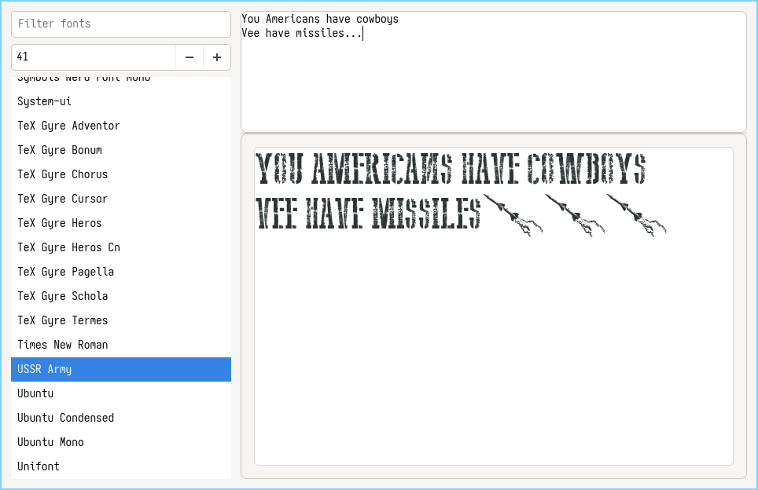

# Font Selector

Russian version: [`README.ru.md`](README.ru.md)

Font Selector is a simple GTK4 desktop application written in Rust for Linux (Xorg-compatible environments). It helps you browse installed system fonts and preview text with different font families and sizes.



## Features

- List installed font families
- Filter fonts quickly by name
- Keyboard navigation in the font list from the filter field (`Up`/`Down`)
- Focus filter with `Ctrl+F`
- Clear filter with `Esc`
- Copy selected font name with context menu or `Ctrl+C`
- Multi-line sample text editor
- Live preview area with white canvas
- Adjustable font size
- Built-in localization for Russian, English, German, French, Spanish, and Esperanto

## Requirements

- Linux with GTK4 runtime and development libraries
- Rust toolchain (`rustc`, `cargo`)
- `pkg-config`

If you use Nix, this repository already includes:

- `shell.nix` for `nix-shell`
- `font-selector.nix` for NixOS packaging

## Build and Run

### Standard Cargo workflow

```bash
cargo check
cargo run
```

### With Nix shell

```bash
nix-shell
cargo run
```

## Install on NixOS

You can install the app into `environment.systemPackages` using `font-selector.nix`.

```nix
{ config, pkgs, ... }:

let
  font-selector = pkgs.callPackage /path/to/font-selector/font-selector.nix {};
in {
  environment.systemPackages = with pkgs; [
    font-selector
  ];
}
```

Then apply the configuration:

```bash
sudo nixos-rebuild switch
```

## Localization

The application selects language in this order:

1. `FONT_SELECTOR_LANG`
2. `LC_ALL`
3. `LANG`

Supported language codes:

- `ru`
- `en`
- `de`
- `fr`
- `es`
- `eo`

Examples:

```bash
FONT_SELECTOR_LANG=en cargo run
LANG=de_DE.UTF-8 cargo run
```

Translations are stored in:

- `i18n/ru.lang`
- `i18n/en.lang`
- `i18n/de.lang`
- `i18n/fr.lang`
- `i18n/es.lang`
- `i18n/eo.lang`

Each translation file uses a simple `key = value` format.

## Project Structure

- `src/main.rs` - application UI and behavior
- `i18n/*.lang` - translation files
- `shell.nix` - development shell for `nix-shell`
- `font-selector.nix` - Nix derivation for NixOS/system install
